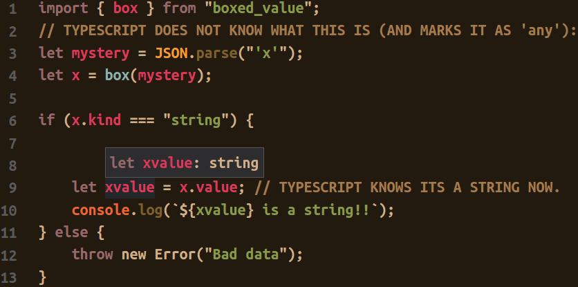

# Boxed Value

An NPM module to bring certainty to uncertain types.

## Why?

You use typescript because it provides compile time type safety.

Sometimes you find yourself needing type safety *after* compile time.
Usually this happens when you are parsing serialized data that entered the application after compile time (Parsing API responses, processing unstructured JSON data, etc..)  

If you've used lodash functions like `_.isArray()` or `_.isBoolean()`, this is sort of the same thing, but hyper focused on TypeScript.

Here's an example of why it's going to make life easier:



Here's another example:

```typescript

// You have no idea what value this is:
let uncertainty = JSON.parse(iDontKnowYouTellMe);
// At this point, typescript will mark the variable as type an "any" type.
//  We don't want that. Let's box it.
import { box } from "boxed_value";

let boxed = box(uncertainty);
switch (boxed.kind) {
    case "string":
        // We can safely do string operations here, because it is guaranteed to be
        // a string type.
        let guaranteedToBeAString = boxed.value;
        // "Unbox" a variable by calling `.value`.
        guaranteedToBeAString.split("");
    case "boolean":
        console.log("Typescript can type check this as `boolean` safely now!");
    default:
        // Default branch is a great place to throw out junk data.
        throw new Error("¯\_(ツ)_/¯");
}
sw
```

## Other Problems Solved

Boxed values can provide mutability to values that would otherwise be immutable.

```typescript

// BEFORE:
var x = 2;
var y = x;
y = 3;
x === 3; // False, because primitive types are passed by value in JS.

// AFTER:
var x = box(2);
var y = x;
y.value = 3;
x.value === 3; // True, because objects are pass by refernce in JS.

```

# Contributing

This is a very new project. Please submit issues for any bugs you may find while using the module.